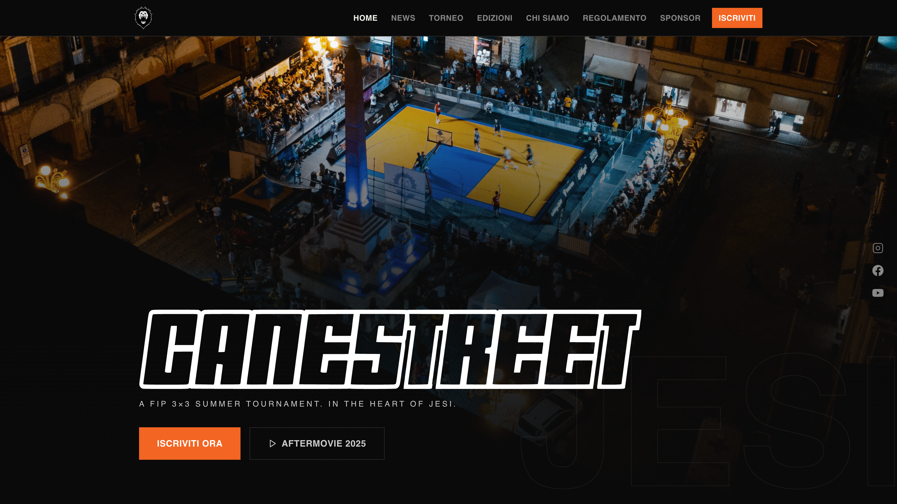

# Canestreet 3×3

Official website of the Canestreet 3×3 basketball tournament — Jesi, Italy.

[](https://nextjs.org/)
[](https://www.typescriptlang.org/)
[](https://tailwindcss.com/)
[](https://supabase.com/)
[](./LICENSE)

Built with **Next.js 14 App Router**, **Tailwind CSS**, and **Supabase** (Postgres + Auth + Storage).



## Features

See the **[User Guide](docs/README.md)** for a complete walkthrough of:

- **[Tournament Management](docs/01-tournament-management.md)** — Group phases, live match calendar, standings, and elimination brackets
- **[3-Point Contest](docs/02-three-point-contest.md)** — Shooting competition with live scoring and qualification rounds
- **[Showcase Screen](docs/03-showcase-screen.md)** — Full-screen display for venue monitors with live updates and auto-scroll
- **[Team Registration](docs/04-team-registration.md)** — Team sign-up, approval workflow, and roster management

Each guide includes both visitor and admin perspectives, so you can understand the full feature from end-to-end.


## Prerequisites

- [Node.js](https://nodejs.org/) 18+
- [Docker Desktop](https://www.docker.com/products/docker-desktop/) (for local Supabase)
- [Supabase CLI](https://supabase.com/docs/guides/cli/getting-started) — `brew install supabase/tap/supabase`

## Local development setup

### 1. Install dependencies

```bash
npm install
```

### 2. Start local Supabase

Make sure Docker Desktop is running, then:

```bash
supabase start
```

This spins up a local Postgres database, Auth, and Storage. All migrations in
`supabase/migrations/` are applied automatically, seeding the database with
historical editions and news content.

### 3. Configure environment variables

```bash
cp .env.local.example .env.local
```

The default values from `supabase start` are already pre-filled in `.env.local.example`
for local development — you typically don't need to change anything.

### 4. Populate Storage with images

Historical cover images and staff photos are stored in `downloaded-media/` (tracked in
the repo). Upload them to the local Supabase Storage bucket with:

```bash
bash scripts/upload-media.sh
```

This creates the `media` bucket and uploads all images. **Re-run this after every
`supabase db reset`** since resetting wipes Storage along with the database.

### 5. Start the dev server

```bash
npm run dev
```

App is available at [http://localhost:3000](http://localhost:3000).
Supabase Studio (database dashboard) is at [http://localhost:54323](http://localhost:54323).

## Commands

```bash
npm run dev      # Start dev server
npm run build    # Production build + type check
npm run lint     # ESLint
npm run start    # Start production server (requires build first)

supabase start        # Start local Supabase stack
supabase stop         # Stop (add --backup to keep data between restarts)
supabase db reset     # Re-apply all migrations (resets all data and storage)
supabase status       # Show local URLs and keys
```


## Creating the first admin user

1. Open Supabase Studio → Authentication → Users → **Add user**
2. Run in the SQL editor (Studio → SQL Editor):

```sql
insert into admins (user_id, email, role)
values ('<auth-user-uuid>', 'you@example.com', 'superadmin');
```

3. Sign in at [http://localhost:3000/admin/login](http://localhost:3000/admin/login)


## Media & images

Cover images for editions, news articles, and staff photos live in two places:

| Location | Purpose |
|---|---|
| `downloaded-media/` | Source files, version-controlled in this repo |
| Supabase Storage `media` bucket | Where the running app reads images from |

The `scripts/upload-media.sh` script syncs from the folder to the bucket.

To add new images to the project:
1. Drop the file in `downloaded-media/`
2. Run `bash scripts/upload-media.sh` (safe to run multiple times — existing files are skipped)
3. Reference the URL `http://127.0.0.1:54321/storage/v1/object/public/media/<filename>` in
   the admin panel or seed SQL


## Deploying to production

1. Create a Supabase project at [supabase.com](https://supabase.com)
2. Run the migrations in `supabase/migrations/` via the SQL editor
3. Upload images to the production `media` bucket (Storage tab) and update `cover_url` values
4. Set the environment variables in your hosting provider (Vercel, etc.):

| Variable | Required | Description |
|---|---|---|
| `NEXT_PUBLIC_SUPABASE_URL` | Yes | Supabase project URL (from project dashboard → Settings → API) |
| `NEXT_PUBLIC_SUPABASE_ANON_KEY` | Yes | Supabase anon/public key — safe to expose to the browser |
| `SUPABASE_SERVICE_ROLE_KEY` | Yes | Supabase service role key — server-side only, bypasses RLS, never expose to the client |
| `NEXT_PUBLIC_SITE_URL` | Yes | Canonical site URL (e.g. `https://canestreet.it`) — used for sitemap and Open Graph metadata |
| `NEXT_PUBLIC_CONTACT_EMAIL` | Yes | Public contact email shown on the site |
| `NEXT_PUBLIC_CONTACT_PHONE` | Yes | Public contact phone number shown on the site |
| `GMAIL_USER` | Yes | Gmail address used to send registration and status-change emails |
| `GMAIL_APP_PASSWORD` | Yes | Gmail [App Password](https://myaccount.google.com/apppasswords) (requires 2FA enabled) — not your regular Gmail password |
| `DISABLE_EMAILS` | No | Set to `true` to suppress all outgoing emails (useful in staging/preview environments) |


## License

This project is open source and licensed under the **[MIT License](./LICENSE)**.

© 2024-2026 Riccardo Maldini. All rights reserved.

If you use this project, please include a copy of the license and attribute the original author.
