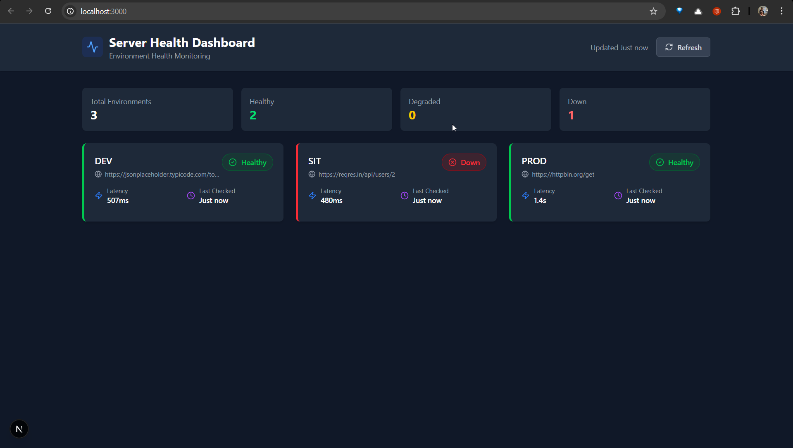
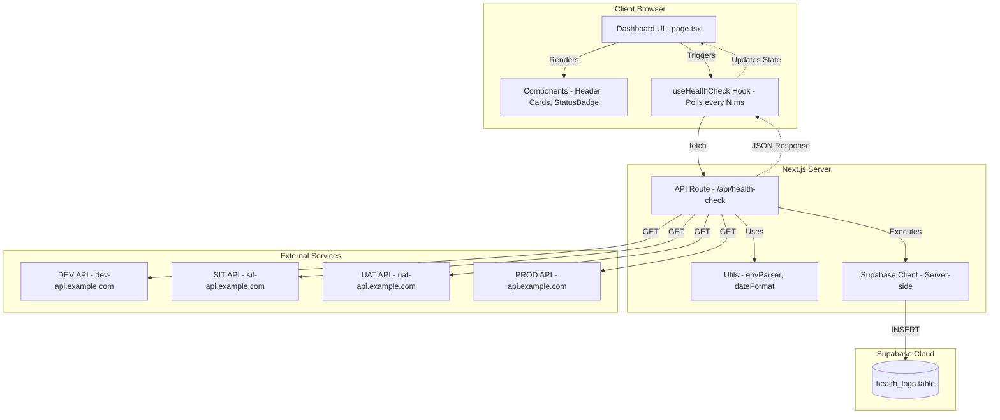

# Server Environment Health Dashboard

A lightweight, real-time **Server Environment Health Dashboard** built with Next.js, React, Tailwind CSS, and Supabase. This application monitors and displays the uptime and latency of API endpoints across different SDLC environments (DEV, SIT, UAT, PROD).

## Features

- ✅ **Dynamic Configuration** - Configure target environments via `.env` file
- 🔄 **Real-time Monitoring** - Auto-refresh at configurable intervals
- 📊 **Latency Tracking** - Measure and display response times
- 🎨 **Color-coded Status** - Green (Healthy), Yellow (Degraded), Red (Down)
- 💾 **Database Logging** - Persistent health check history via Supabase
- 📱 **Responsive Design** - Works on desktop, tablet, and mobile
- 🌙 **Dark Mode Support** - Automatic dark mode detection
- ⚡ **Parallel Health Checks** - Fast, concurrent endpoint checking

## Screenshot



## Tech Stack

| Layer | Technology |
|-------|-----------|
| Framework | Next.js 16 (App Router) |
| Language | TypeScript |
| Styling | Tailwind CSS |
| Icons | Lucide React |
| Database | Supabase |
| State Management | React Hooks (useState, useEffect) |

## System Architecture



## Project Structure

```
server-health-dashboard/
├── .env.local                    # Environment variables (local, git-ignored)
├── .env.local.example            # Environment variables template
├── package.json                  # Dependencies and scripts
├── tsconfig.json                 # TypeScript configuration
├── tailwind.config.cjs           # Tailwind CSS configuration
├── postcss.config.cjs            # PostCSS configuration
├── README.md                     # This file
├── supabase/                     # Supabase CLI project directory
│   ├── config.toml               # Supabase project configuration
│   ├── seed.sql                  # Seed data for local development
│   ├── migrations/               # Database migration files
│   ├── snippets/                 # SQL snippets
│   ├── .branches/                # Branch metadata (git-ignored)
│   └── .temp/                    # Temporary CLI files (git-ignored)
└── src/
    ├── app/                      # Next.js App Router
    │   ├── layout.tsx            # Root layout component
    │   ├── page.tsx              # Main dashboard page
    │   ├── globals.css           # Global styles
    │   └── api/
    │       └── health-check/
    │           └── route.ts      # Health check API endpoint
    ├── components/               # React UI components
    │   ├── index.ts              # Component exports
    │   ├── Header.tsx            # Dashboard header
    │   ├── EnvironmentCard.tsx   # Environment status card
    │   ├── StatusBadge.tsx       # Status indicator badge
    │   └── LoadingSkeleton.tsx   # Loading state placeholders
    ├── hooks/                    # Custom React hooks
    │   └── useHealthCheck.ts     # Health check polling hook
    ├── lib/                      # External service clients
    │   └── supabase.ts           # Supabase client & helpers
    ├── types/                    # TypeScript type definitions
    │   └── index.ts              # All type exports
    └── utils/                    # Utility functions
        ├── index.ts              # Utility exports
        ├── envParser.ts          # Environment config parser
        └── dateFormat.ts         # Date/time formatting
```

## Getting Started

### Prerequisites

- **Node.js** 18.17 or later
- **npm**, **yarn**, or **pnpm** package manager
- **Supabase** account (free tier available)

### Installation

1. **Clone the repository** (or use this directory):
   ```bash
   cd server-health-dashboard
   ```

2. **Install dependencies**:
   ```bash
   npm install
   ```

### Supabase Setup

1. **Create a Supabase project** at [https://supabase.com](https://supabase.com)

2. **Initialize Supabase CLI** (if not already done):
   ```bash
   npx supabase init
   ```

3. **Link your project**:
   ```bash
   npx supabase link --project-ref <your-project-ref>
   ```
   You'll be prompted for your database password.

4. **Push the migration** to your Supabase project:
   ```bash
   npx supabase db push
   ```

   This creates:
   - `health_logs` table with proper schema
   - Composite index for fast queries
   - Row Level Security (RLS) policies
   - Public read access policy

5. **Get your credentials**:
   - Go to **Settings** → **API** in your Supabase dashboard
   - Copy **Project URL** (`NEXT_PUBLIC_SUPABASE_URL`)
   - Copy **anon public key** (`NEXT_PUBLIC_SUPABASE_ANON_KEY`)
   - Copy **service_role secret** (`SUPABASE_SERVICE_ROLE_KEY`)

### Environment Configuration

1. **Copy the example environment file**:
   ```bash
   cp .env.local .env.local
   ```

2. **Update the `.env.local` file** with your values:

   ```env
   # Supabase Configuration
   NEXT_PUBLIC_SUPABASE_URL="https://[PROJECT_ID].supabase.co"
   NEXT_PUBLIC_SUPABASE_ANON_KEY="your-anon-key-here"
   SUPABASE_SERVICE_ROLE_KEY="your-service-role-key-here"

   # Target Environments (Format: ENV|URL,ENV|URL)
   TARGET_ENVIRONMENTS="DEV|https://jsonplaceholder.typicode.com/todos/1,SIT|https://reqres.in/api/users/2,PROD|https://httpbin.org/get"

   # Polling Interval (milliseconds)
   NEXT_PUBLIC_POLLING_INTERVAL=60000
   ```

   **Environment Variable Reference:**

   | Variable | Type | Required | Description |
   |----------|------|----------|-------------|
   | `NEXT_PUBLIC_SUPABASE_URL` | string | ✅ | Supabase project URL |
   | `NEXT_PUBLIC_SUPABASE_ANON_KEY` | string | ✅ | Supabase anonymous key (client-side) |
   | `SUPABASE_SERVICE_ROLE_KEY` | string | ✅ | Supabase service role key (server-side only) |
   | `TARGET_ENVIRONMENTS` | string | ✅ | Comma-separated `ENV_NAME|URL` pairs |
   | `NEXT_PUBLIC_POLLING_INTERVAL` | number | ❌ | Auto-refresh interval in ms (default: 60000) |

### Running the Application

1. **Development mode**:
   ```bash
   npm run dev
   ```
   Open [http://localhost:3000](http://localhost:3000) in your browser.

2. **Production build**:
   ```bash
   npm run build
   npm start
   ```

## How It Works

### Health Check Logic

The `/api/health-check` endpoint performs the following steps:

1. **Parse environments** from `TARGET_ENVIRONMENTS` environment variable
2. **Ping each URL** concurrently with a 10-second timeout
3. **Measure latency** (response time in milliseconds)
4. **Determine status**:
   - 🟢 **Healthy**: HTTP 200 OK and latency ≤ 2000ms
   - 🟡 **Degraded**: HTTP 200 OK but latency > 2000ms
   - 🔴 **Down**: Non-2xx status code, timeout, or network error
5. **Log results** to Supabase `health_logs` table (asynchronous, non-blocking)
6. **Return results** to the client as JSON

### Status Determination

```typescript
// Pseudocode for status logic
if (statusCode !== 200 || error) {
  return 'down'        // 🔴
} else if (latencyMs > 2000) {
  return 'degraded'    // 🟡
} else {
  return 'healthy'     // 🟢
}
```

### Database Schema

The `health_logs` table stores historical health check data:

| Column | Type | Description |
|--------|------|-------------|
| `id` | UUID | Primary key (auto-generated) |
| `env_name` | VARCHAR(50) | Environment name (e.g., 'DEV', 'PROD') |
| `url` | TEXT | Full URL that was checked |
| `status` | VARCHAR(20) | Status: 'healthy', 'degraded', or 'down' |
| `latency_ms` | INTEGER | Response time in milliseconds |
| `created_at` | TIMESTAMP | When the check occurred (UTC) |

**Performance Note:** A composite index on `(env_name, created_at DESC)` ensures fast queries even with millions of rows.

### Security

- **Service Role Key** (`SUPABASE_SERVICE_ROLE_KEY`) is used **only** in server-side API routes
- **Anonymous Key** (`NEXT_PUBLIC_SUPABASE_ANON_KEY`) is used for client-side operations
- **Row Level Security (RLS)** is enabled on the `health_logs` table
- **Read-only access** is granted to the public; write access requires service role key

## API Reference

### `GET /api/health-check`

Performs health checks on all configured environments and returns results.

**Response:**

```json
{
  "success": true,
  "results": [
    {
      "envName": "DEV",
      "url": "https://dev-api.example.com/health",
      "status": "healthy",
      "latencyMs": 145,
      "timestamp": "2024-04-10T10:30:00.000Z",
      "error": null
    },
    {
      "envName": "PROD",
      "url": "https://api.example.com/health",
      "status": "degraded",
      "latencyMs": 2500,
      "timestamp": "2024-04-10T10:30:00.000Z",
      "error": null
    }
  ]
}
```

**Error Response:**

```json
{
  "success": false,
  "results": [],
  "error": "TARGET_ENVIRONMENTS is not configured in environment variables."
}
```

## Customization

### Adding New Environments

Edit the `TARGET_ENVIRONMENTS` variable in `.env.local`:

```env
TARGET_ENVIRONMENTS="DEV|https://dev-api.example.com/health,SIT|https://sit-api.example.com/health,UAT|https://uat-api.example.com/health,PROD|https://api.example.com/health,STAGING|https://staging-api.example.com/health"
```

### Changing Latency Thresholds

Modify the threshold in `src/utils/envParser.ts`:

```typescript
// Current threshold: 2000ms (2 seconds)
if (latencyMs > 2000) {
  return 'degraded';
}
```

### Styling

The dashboard uses Tailwind CSS. Customize colors and styles in:
- `tailwind.config.js` - Theme extensions
- `src/components/*.tsx` - Component-specific styles

### Adding Historical Charts

To display historical data from Supabase:

1. Create a new API route (e.g., `/api/health-history`)
2. Query `health_logs` with date filters
3. Add a charting library like `recharts` or `chart.js`
4. Create a `HistoryChart` component

## Deployment

### Vercel (Recommended)

1. Push your code to GitHub
2. Import the repository in [Vercel](https://vercel.com)
3. Add environment variables in Vercel settings
4. Deploy

### Docker

Create a `Dockerfile`:

```dockerfile
FROM node:20-alpine AS builder
WORKDIR /app
COPY package*.json ./
RUN npm ci
COPY . .
RUN npm run build

FROM node:20-alpine AS runner
WORKDIR /app
COPY --from=builder /app/package*.json ./
COPY --from=builder /app/.next ./.next
COPY --from=builder /app/public ./public
COPY --from=builder /app/node_modules ./node_modules
EXPOSE 3000
CMD ["npm", "start"]
```

### Environment Variables for Production

Ensure all required environment variables are set in your hosting platform:

- `NEXT_PUBLIC_SUPABASE_URL`
- `NEXT_PUBLIC_SUPABASE_ANON_KEY`
- `SUPABASE_SERVICE_ROLE_KEY`
- `TARGET_ENVIRONMENTS`
- `NEXT_PUBLIC_POLLING_INTERVAL` (optional)

## Troubleshooting

### Common Issues

**Issue:** Dashboard shows "No environments configured"
- **Solution:** Check that `TARGET_ENVIRONMENTS` is set in `.env.local` and follows the correct format (`ENV|URL,ENV|URL`)

**Issue:** Health checks fail with network errors
- **Solution:** Ensure the target URLs are accessible from your server/Vercel deployment. Some firewalls block outbound requests.

**Issue:** Supabase logging fails
- **Solution:** Verify your Supabase credentials in `.env.local`. Check that the `health_logs` table exists and RLS policies are configured correctly.

**Issue:** Auto-refresh not working
- **Solution:** Check `NEXT_PUBLIC_POLLING_INTERVAL` value. Must be a positive integer in milliseconds.

### Debug Mode

Enable Next.js debug logging:

```bash
DEBUG=next* npm run dev
```

## Contributing

1. Fork the repository
2. Create a feature branch (`git checkout -b feature/amazing-feature`)
3. Commit your changes (`git commit -m 'Add amazing feature'`)
4. Push to the branch (`git push origin feature/amazing-feature`)
5. Open a Pull Request

## License

This project is licensed under the MIT License - see the [LICENSE](LICENSE) file for details.

## Support

For issues and questions:
- Open an issue on GitHub
- Check the [Supabase documentation](https://supabase.com/docs)
- Check the [Next.js documentation](https://nextjs.org/docs)
