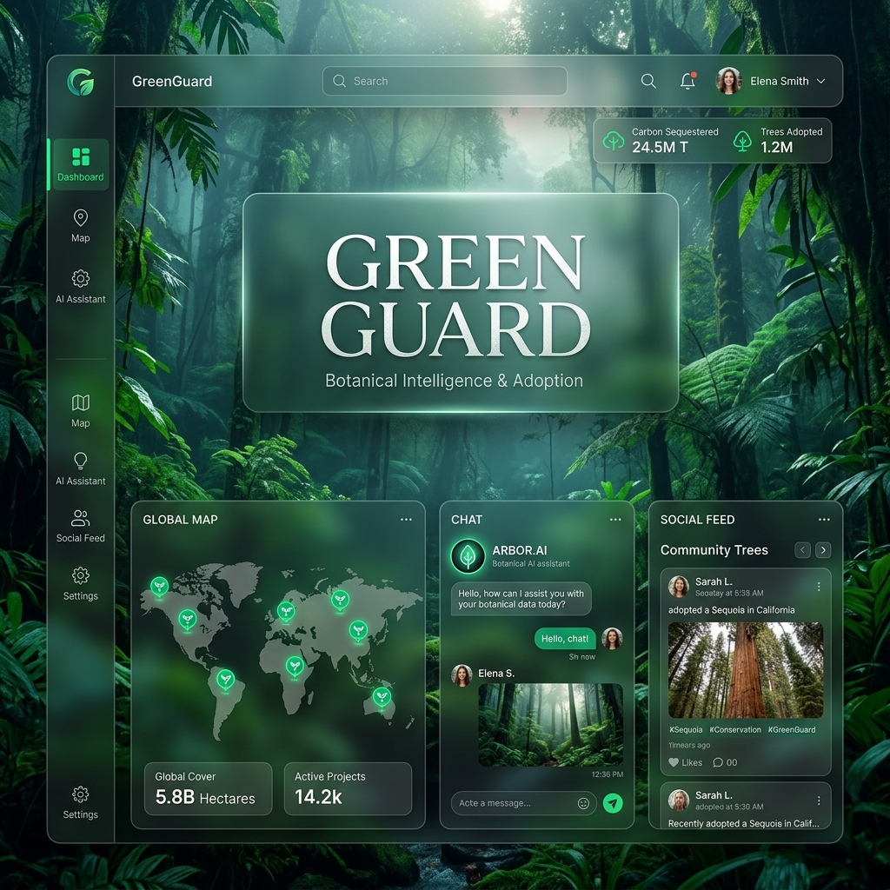
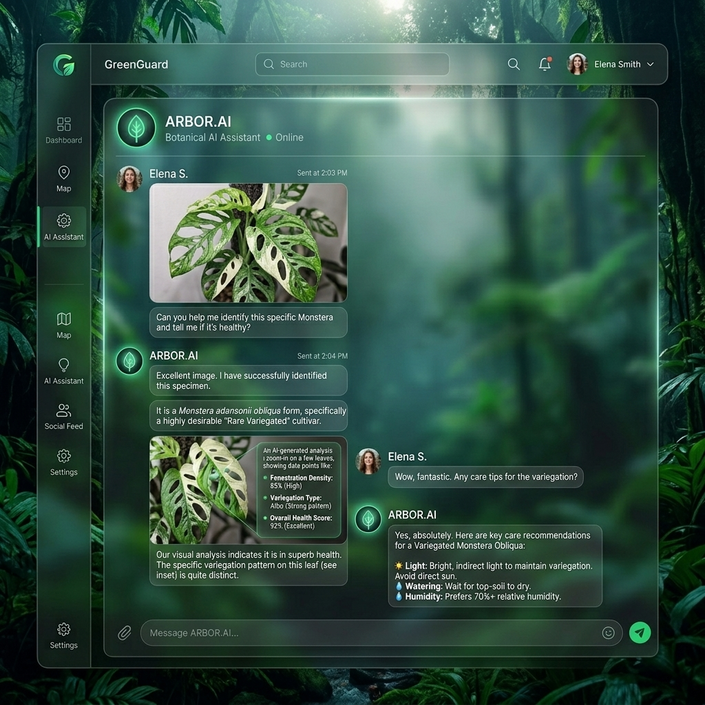
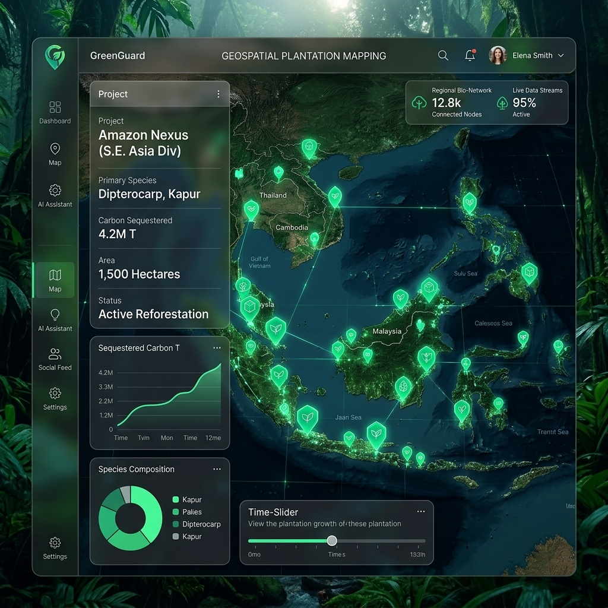
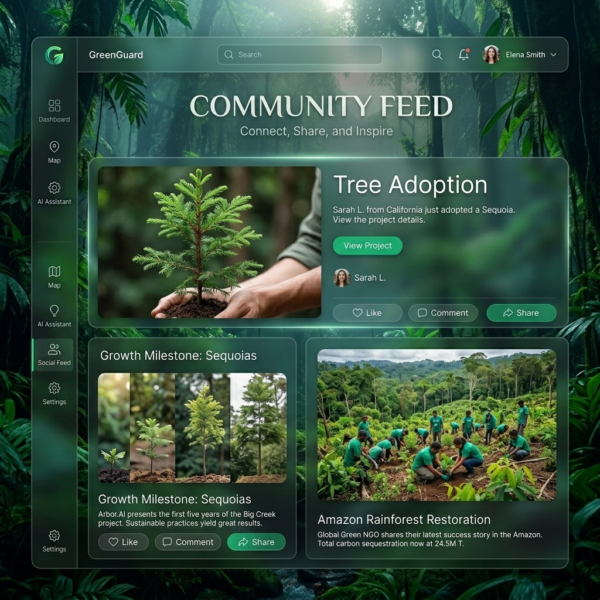

# GreenGuard

| RELEASE | **v1.0.0** | BOTANICAL DATA | **300+ SPECIES** | UI STYLES | **50+ COMPONENTS** | STACK | **NEXT.js 16** | LICENSE | **MIT** |
| :--- | :--- | :--- | :--- | :--- | :--- | :--- | :--- | :--- | :--- |

[](https://huggingface.co/spaces/shard-c6/green-guard-api)
[](https://greeguardfe.vercel.app/)
[](https://huggingface.co/spaces/shard-c6/flora-genius-service)
[](https://github.com/shard-c6/greeguard_complete/stargazers)

**A premium botanical identification and adoption ecosystem powered by AI and RAG-based intelligence.**



## ✨ Core Ecosystem Highlights

| 🤖 AI Botanical Consultant | 🗺️ Geospatial Plantation Mapping | 🤝 Community Social Feed |
| :--- | :--- | :--- |
|  |  |  |
| **Real-time Identification**: Powered by Gemini 1.5 Flash and PlantNet, providing instant botanical diagnostics. | **Interactive Impact**: Live reforestation tracking with precise geospatial coordinates and carbon metrics. | **Sustainable Social**: Share growth milestones, adopt trees, and connect with verified environmental NGOs. |

---

## 📖 Overview

GreenGuard is a state-of-the-art environmental platform designed to bridge the gap between Non-Governmental Organizations (NGOs) and nature enthusiasts. By combining high-fidelity UI/UX with advanced Retrieval-Augmented Generation (RAG), we transform environmental conservation into an immersive, social, and AI-enhanced journey.

---

## ✨ Key Features

- **🧠 Flora Genius Consultant (RAG AI)**: Standalone microservice utilizing Google Gemini for reasoning and Supabase `pgvector` for grounded botanical advice. Now featuring **Stateful Conversational Memory** using the `startChat` interface for multi-turn dialogues.
- **🎨 Premium Visual Engine**: Next.js 16 + React 19 + Tailwind CSS 4 implementation featuring **Glassmorphism 2.0**, **Framer Motion 12**, and immersive **Atmospheric Backgrounds**.
- **🗺️ Geospatial Discovery**: Integrated PostGIS to enable radius-based searches and live interactive plantation mapping.
- **🛡️ NGO Verification**: Multi-step onboarding with Darpan ID validation and administrative impact questionnaires.
- [📸 Growth Timeline](./docs/FEATURES.md#growth-timeline): Track plant health from sapling to tree with health metrics and community sharing.

---

## 🛡️ System Integrity & Reliability

GreenGuard is built for long-term sustainability. We employ automated systems to ensure the repository remains healthy, active, and documented.

- **🤖 Automated Daily Heartbeat**: A scheduled GitHub Action that validates repository connectivity and ensures daily progress tracking.
- **📜 Live Technical Log**: All system updates and automated health checks are recorded in our [DAILY_LOG.md](./DAILY_LOG.md).
- **🚀 CI/CD Rulesets**: Protected `main` branch with automated deployment to Hugging Face via GitHub Actions.
- **✅ Continuous Monitoring**: Real-time status tracking of our AI microservices and database integrity.

---

## 🛠️ Technology Stack

| Layer | Technologies |
| :--- | :--- |
| **Frontend** | Next.js 16, React 19, Tailwind CSS 4, Framer Motion, Axios, Leaflet |
| **Backend** | Node.js, Express.js, Supabase, PostGIS, JWT |
| **AI/ML** | Google Gemini 1.5 Flash, Supabase `pgvector` (RAG) |
| **DevOps** | Hugging Face Spaces, Vercel (Frontend), Supabase (DB/Auth) |

---

## 🚀 Getting Started

### 1. Clone & Setup

```bash
git clone https://github.com/shard-c6/greeguard_complete.git
cd greeguard_complete
```

### 2. Environment Configuration

Configure `.env` files in `backend/`, `frontend/`, and `flora-genius-consultant/` using the provided templates.

### 3. Run Services

```bash
# Terminal 1: Backend
cd backend && npm run dev

# Terminal 2: Frontend
cd frontend && npm run dev

# Terminal 3: AI Consultant
cd flora-genius-consultant && npm run dev
```

---

## 🤝 Join the Mission

We welcome contributions from environmentalists and developers of all skill levels. Whether you're fixing a bug, adding botanical data, or suggesting a feature, your impact matters.

### 🗺️ Project Roadmap

- [ ] **Mobile Transition**: Expanding the UI to a native mobile experience via Capacitor & Offline PWAs.
- [x] **Advanced RAG**: Integrated hybrid search and stateful conversational memory for precision diagnostics.
- [x] **Global Species Expansion**: Successfully reached 500+ validated botanical entries.
- [ ] **Scalability Engine**: Implementing Redis caching, Edge middleware, and API rate limiting.
- [ ] **UI/UX Polish**: Smooth page transitions and micro-interactions using Framer Motion.

### 🚀 How to Contribute

1. **Explore**: Check out [DAILY_LOG.md](./DAILY_LOG.md) to see what's currently in progress.
2. **Setup**: Follow the [Getting Started](#-getting-started) guide to run the project locally.
3. **Standards**: Ensure all PRs include relevant updates to the technical log and documentation.
4. **Submit**: Create a pull request against the `main` branch with a clear description of your changes.

**Need inspiration?** Look for `good first issue` tags in our issues or propose a new feature in the discussions!

---

## 📄 Documentation

- [**Getting Started Guide**](./docs/GETTING_STARTED.md) — Complete local development and onboarding guide.
- [**API Specification**](./docs/API_SPECIFICATION.md) — Flora Genius AI Consultant endpoint details.
- [**Database & RAG Logic**](./docs/DATABASE_AND_RAG.md) — Supabase schema, PostGIS spatial queries, and pgvector RAG mechanics.
- [**Contributing Guidelines**](./CONTRIBUTING.md) — Branch naming standards, GPG/SSH signature requirements, and workflows.
- [**Project Report**](./docs/PROJECT_REPORT.md) — Full ecosystem walkthrough.
- [**Technical Handover**](./docs/TECHNICAL_HANDOVER.md) — Architectural details and schema logic.
- [**Deployment Guide**](./docs/DEPLOYMENT_AND_TESTING.md) — Production setup and seeding.

---

## 🛡️ License

This project is licensed under the MIT License - see the [LICENSE](LICENSE) file for details.
