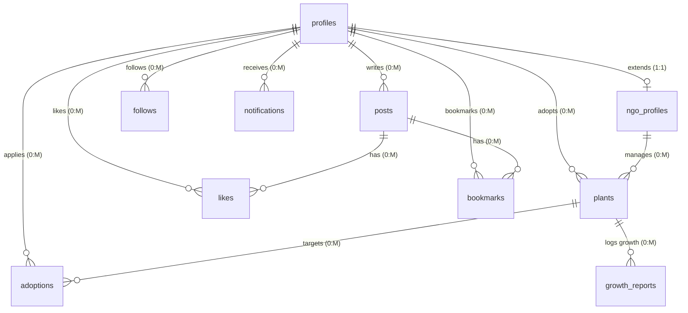
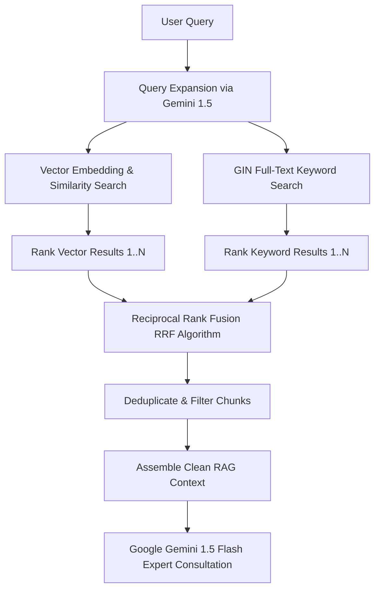

# 🗄️ Database Architecture & RAG Retrieval Logic

GreenGuard uses a high-performance **Supabase PostgreSQL** database optimized for geospatial tracking (via **PostGIS**) and advanced botanical information retrieval (via **pgvector**).

---

## 🗺️ Entity Relationship Overview



---

## 💾 Core Schema Reference

### 1. `profiles` Table
Stores basic user identity synced automatically from Supabase Auth.
* `id` *(UUID, Primary Key)*: References `auth.users(id)`
* `role` *(TEXT)*: Constraints: `'admin'`, `'ngo'`, `'adopter'` (Default: `'adopter'`)
* `username` *(TEXT, Unique, Not Null)*
* `display_name` *(TEXT)*
* `email` *(TEXT, Unique, Not Null)*
* `phone` / `avatar_url` / `bio` / `address` *(TEXT)*
* `is_banned` *(BOOLEAN, Default: false)*

### 2. `ngo_profiles` Table
Stores verified organization metadata linked 1:1 to `profiles`.
* `id` *(UUID, Primary Key)*: References `profiles(id)`
* `org_name` *(TEXT, Not Null)*
* `registration_number` *(TEXT)*
* `website` / `mission` / `address` *(TEXT)*
* `status` *(TEXT)*: Constraints: `'pending'`, `'approved'`, `'rejected'`, `'suspended'` (Default: `'pending'`)
* `approved_by` *(UUID)*: References `profiles(id)` (Admin)

### 3. `plants` Table (Geospatial Enabled)
Contains data on all plantable/planted assets tracked by the ecosystem.
* `id` *(UUID, Primary Key)*
* `ngo_id` *(UUID)*: References `profiles(id)`
* `plant_name` *(TEXT, Not Null)*
* `species` *(TEXT)*
* `location` *(GEOGRAPHY(Point, 4326))*: PostGIS point containing longitude and latitude.
* `adoption_status` *(TEXT)*: Constraints: `'available'`, `'pending'`, `'adopted'` (Default: `'available'`)
* `adopted_by` *(UUID)*: References `profiles(id)`

### 4. `plant_knowledge` Table (Vector RAG Enabled)
Stores pre-processed, high-density botanical articles and guidelines.
* `id` *(UUID, Primary Key)*
* `plant_name` *(TEXT)*
* `scientific_name` *(TEXT)*
* `content` *(TEXT, Not Null)*: Core markdown context of the article.
* `embedding` *(VECTOR(768))*: High-dimensional text embeddings generated using Google's text-embedding-004 model.
* `fts` *(TSVECTOR)*: Auto-generated search vector for full-text keyword indexing.

---

## 📍 PostGIS Geospatial Queries

To retrieve planted trees situated within a geographical radius of a user (e.g., for map visualizations or local NGO updates), GreenGuard executes spatial indexing via standard **GIST indexes** on the `location` column.

The system exposes a database RPC function `nearby_plants` to quickly calculate distances:

```sql
CREATE OR REPLACE FUNCTION nearby_plants(user_lat DOUBLE PRECISION, user_lng DOUBLE PRECISION, radius_meters INT DEFAULT 10000)
RETURNS TABLE (
  id UUID,
  ngo_id UUID,
  plant_name TEXT,
  species TEXT,
  image_urls TEXT[],
  adoption_status TEXT,
  distance_meters DOUBLE PRECISION,
  latitude DOUBLE PRECISION,
  longitude DOUBLE PRECISION
) AS $$
BEGIN
  RETURN QUERY
  SELECT
    p.id,
    p.ngo_id,
    p.plant_name,
    p.species,
    p.image_urls,
    p.adoption_status,
    ST_Distance(p.location, ST_SetSRID(ST_MakePoint(user_lng, user_lat), 4326)::geography) AS distance_meters,
    ST_Y(p.location::geometry) AS latitude,
    ST_X(p.location::geometry) AS longitude
  FROM plants p
  WHERE ST_DWithin(
    p.location,
    ST_SetSRID(ST_MakePoint(user_lng, user_lat), 4326)::geography,
    radius_meters
  )
  ORDER BY distance_meters;
END;
$$ LANGUAGE plpgsql SECURITY DEFINER SET search_path = public;
```

---

## 🧠 Hybrid Search & RAG Retrieval Flow

The Flora Genius AI Consultant utilizes **Reciprocal Rank Fusion (RRF)** to combine structural vector similarity search with keyword search. This mitigates common failure modes where vector lookup misses specific nomenclature, or keyword search misses semantic context.



### 1. Query Expansion
When a user submits a query (e.g., *"why is my tree dying"*), the consultant service expands it into multiple variants (e.g., *"plant diseases symptoms"*, *"botanical health diagnosis"*) to capture a wider vector context.

### 2. Reciprocal Rank Fusion (RRF) RPC
The combined results of semantic cosine similarity and lexical keyword ranking are fused together. The PostgreSQL function uses a smoothing constant of `60` to weight the fusion score (`similarity`):

$$Score_{RRF} = \sum_{m \in M} \frac{1}{60 + r_m(d)}$$

Where $r_m(d)$ represents the rank of document $d$ in search system $m$.

```sql
CREATE OR REPLACE FUNCTION hybrid_plant_search(
  query_text TEXT,
  query_embedding VECTOR(768),
  match_count INT DEFAULT 5,
  match_threshold FLOAT DEFAULT 0.2
)
RETURNS TABLE (
  id UUID,
  content TEXT,
  scientific_name TEXT,
  similarity FLOAT
) AS $$
BEGIN
  RETURN QUERY
  WITH semantic_search AS (
    SELECT 
      pk.id, 
      pk.content, 
      pk.scientific_name,
      1 - (pk.embedding <=> query_embedding) AS score,
      ROW_NUMBER() OVER (ORDER BY pk.embedding <=> query_embedding) as rank
    FROM public.plant_knowledge pk
    WHERE 1 - (pk.embedding <=> query_embedding) > match_threshold
    LIMIT match_count * 2
  ),
  keyword_search AS (
    SELECT 
      pk.id, 
      pk.content, 
      pk.scientific_name,
      ts_rank_cd(pk.fts, websearch_to_tsquery('english', query_text)) AS score,
      ROW_NUMBER() OVER (ORDER BY ts_rank_cd(pk.fts, websearch_to_tsquery('english', query_text)) DESC) as rank
    FROM public.plant_knowledge pk
    WHERE pk.fts @@ websearch_to_tsquery('english', query_text)
    LIMIT match_count * 2
  )
  SELECT 
    COALESCE(s.id, k.id) as id,
    COALESCE(s.content, k.content) as content,
    COALESCE(s.scientific_name, k.scientific_name) as scientific_name,
    (
      COALESCE(1.0::FLOAT8 / (60 + s.rank)::FLOAT8, 0.0::FLOAT8) + 
      COALESCE(1.0::FLOAT8 / (60 + k.rank)::FLOAT8, 0.0::FLOAT8)
    )::FLOAT8 AS similarity
  FROM semantic_search s
  FULL OUTER JOIN keyword_search k ON s.id = k.id
  ORDER BY similarity DESC
  LIMIT match_count;
END;
$$ LANGUAGE plpgsql SECURITY DEFINER SET search_path = public;
```

---
> [!TIP]
> All RPC functions execute with `SECURITY DEFINER` constraints to ensure sandboxed schema parsing while maintaining strict Row Level Security (RLS) configuration across tenant scopes. Refer to [API_SPECIFICATION.md](API_SPECIFICATION.md) for how the microservice connects to these endpoints.
