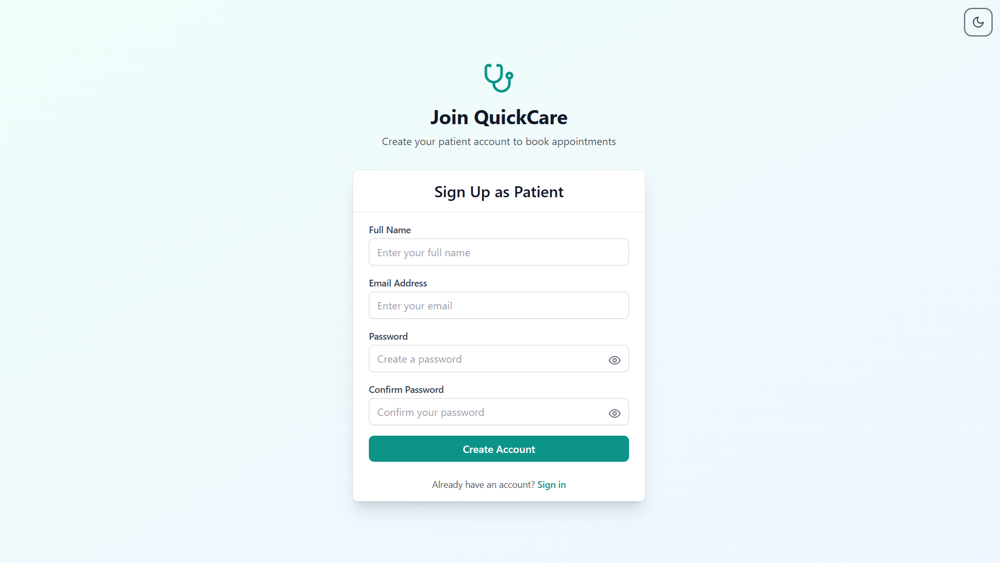
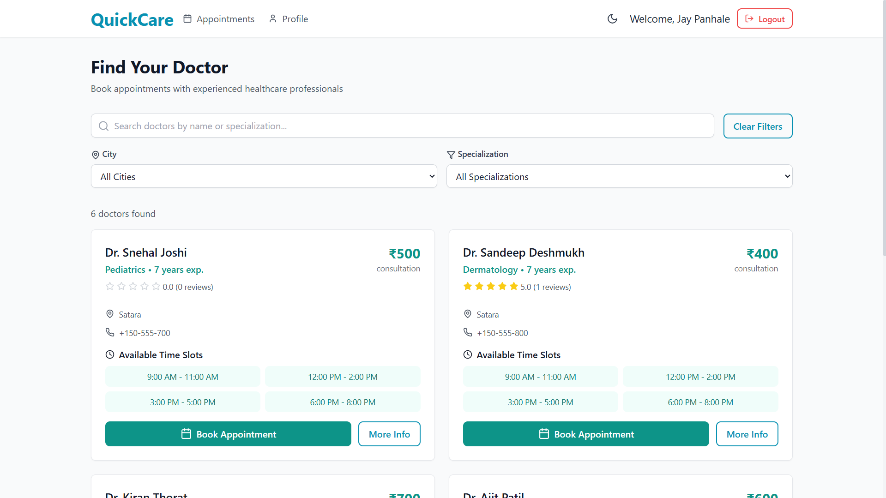
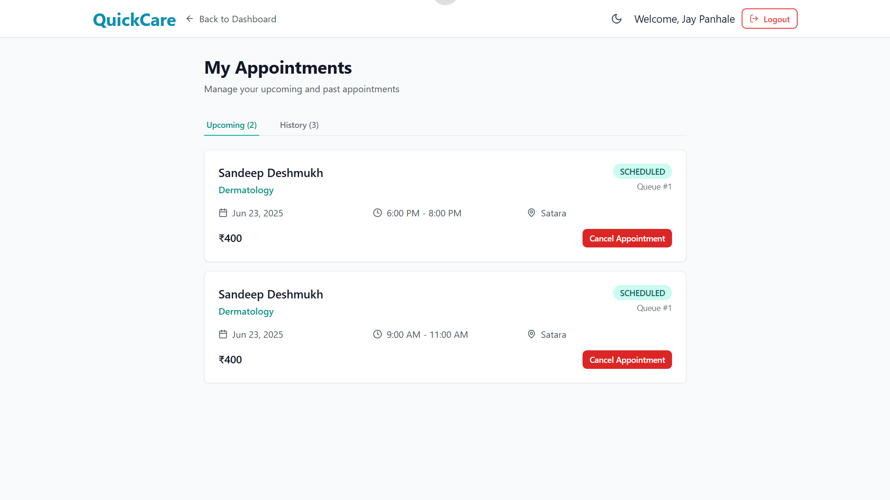
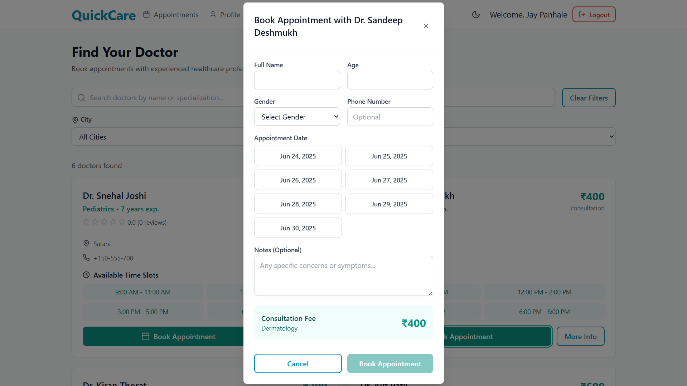
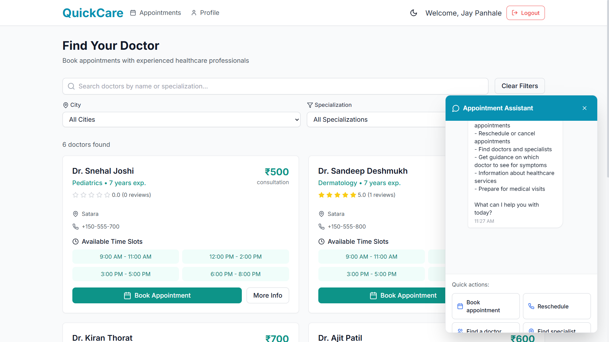
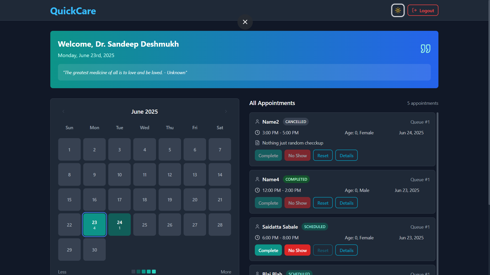
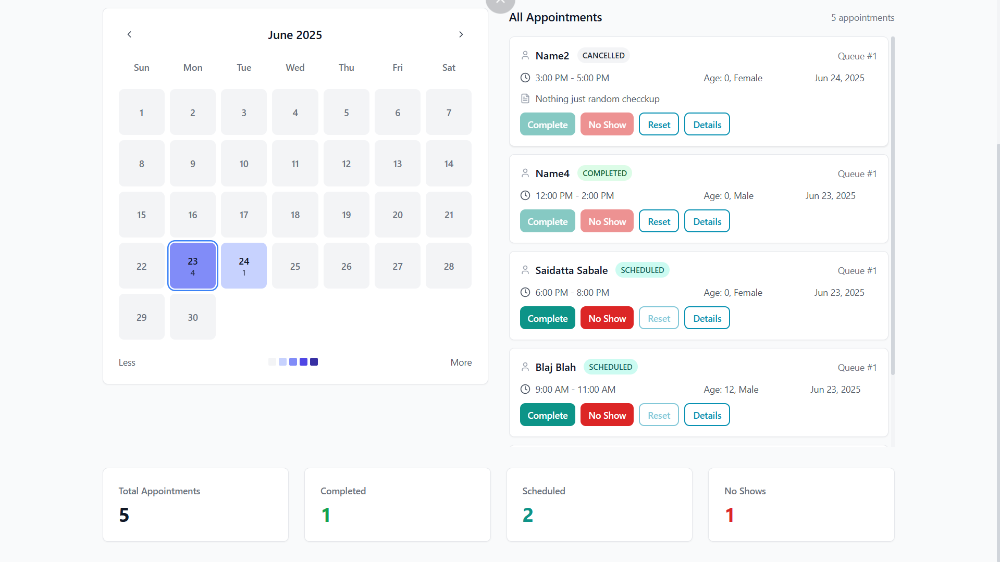

# QuickCare - Healthcare Appointment System

QuickCare is a modern healthcare appointment management system that connects patients with healthcare providers. It offers a seamless experience for booking, managing, and tracking medical appointments.

## 👥 Contributors

- [@OM Pharande](https://github.com/OmPharande) – Developer, Maintainer

## 🔗 Live Demo

[Visit the deployed app here](https://quick-care-xi.vercel.app)

## Features

- **User Authentication**: Secure sign-in and sign-up for both patients and doctors
- **Role-based Dashboards**: Separate interfaces for patients and healthcare providers
- **Appointment Scheduling**: Easy booking system with calendar integration
- **Doctor Profiles**: Detailed information about healthcare providers
- **Responsive Design**: Works on desktop and mobile devices
- **Real-time Updates**: Stay informed about appointment status changes
- **Dark Mode**: Eye-friendly interface with light/dark theme support
- **AI Chatbot Assistant**: Integrated Gemini-powered chatbot to help users with booking, rescheduling, finding doctors, and answering healthcare service questions

## AI Chatbot Assistant

QuickCare includes an AI-powered chat assistant (Gemini API) to help users:

- Book, reschedule, or cancel appointments
- Find doctors and specialists
- Get guidance on which doctor to see for symptoms
- Learn about healthcare services and how to prepare for visits

The chatbot is accessible via the floating chat button on every page. It uses the Google Gemini API and requires a valid `GEMINI_API_KEY` in your environment variables.

**Environment variable required:**
```
GEMINI_API_KEY=your_gemini_api_key
```
Optionally, you can set the model with:
```
GEMINI_MODEL=gemini-2.0-flash
```
or leave it blank to use the default.

## Tech Stack

- **Frontend**: Next.js 13+ with TypeScript
- **Styling**: Tailwind CSS
- **Authentication**: Next-Auth
- **Database**: Supabase
- **State Management**: Zustand
- **Form Handling**: React Hook Form
- **UI Components**: Custom components with Radix UI primitives

## Getting Started

### Prerequisites

- Node.js 16.8 or later
- npm or yarn
- Supabase account

### Installation

1. Clone the repository:
   ```bash
   git clone [[your-repository-url]](https://github.com/saidatta64/QuickCare.git)
   cd QuickCare
   ```

2. Install dependencies:
   ```bash
   npm install
   # or
   yarn install
   ```

3. Set up environment variables:
   Create a `.env.local` file in the root directory and add the necessary environment variables:
   ```
   NEXT_PUBLIC_SUPABASE_URL=your_supabase_url
   NEXT_PUBLIC_SUPABASE_ANON_KEY=your_supabase_anon_key
   NEXTAUTH_SECRET=your_nextauth_secret
   NEXTAUTH_URL=http://localhost:3000
   GEMINI_API_KEY=your_gemini-2.0-flash_api_key
   ```

4. Run the development server:
   ```bash
   npm run dev
   # or
   yarn dev
   ```

5. Open [http://localhost:3000](http://localhost:3000) in your browser.

## Project Structure

```
project/
├── app/                        # Next.js App Router pages and layouts
│   ├── api/                    # API routes (REST endpoints)
│   │   ├── appointments/       # Appointment APIs (CRUD)
│   │   ├── assistant/          # (Legacy) Gemini assistant API
│   │   ├── auth/               # Auth endpoints (register, [...nextauth])
│   │   ├── chat/               # Gemini chat API (used by chatbot)
│   │   ├── doctors/            # Doctor listing API
│   │   ├── reviews/            # Review API
│   │   └── user/               # User profile/password APIs
│   ├── auth/                   # Sign in/up pages
│   ├── doctor/                 # Doctor dashboard and pages
│   ├── patient/                # Patient dashboard, appointments, profile
│   ├── providers/              # React context providers (e.g., AuthProvider)
│   └── layout.tsx              # Root layout
├── components/                 # Reusable UI and feature components
│   ├── assistant/              # Chatbot and floating chat button
│   ├── calendar/               # Calendar and heatmap components
│   ├── doctor/                 # Doctor dashboard components
│   ├── layout/                 # Header, navigation, etc.
│   ├── patient/                # Patient dashboard components
│   └── ui/                     # Base UI components (Button, Card, Modal, etc.)
├── config/                     # Configuration files (Gemini, service accounts)
├── hooks/                      # Custom React hooks (e.g., useTheme)
├── lib/                        # Utility functions and Supabase/auth config
├── public/                     # Static assets (images, favicon, etc.)
├── store/                      # Zustand store for global state
├── supabase/                   # Supabase migrations and metadata
├── types/                      # TypeScript type definitions
├── .gitignore
├── next.config.js
├── postcss.config.js
├── tailwind.config.ts
├── README.md
└── ... (other config and env files)
```

## Environment Variables

The following environment variables are required to run the application:

- `NEXT_PUBLIC_SUPABASE_URL`: Your Supabase project URL
- `NEXT_PUBLIC_SUPABASE_ANON_KEY`: Your Supabase anonymous key
- `NEXTAUTH_SECRET`: A secret key for NextAuth.js
- `NEXTAUTH_URL`: The base URL of your application
- `GEMINI_API_KEY`: Your Google Gemini API key

## Demo images here

      

## License

This project is licensed under the MIT License - see the [LICENSE](LICENSE) file for details.

## Support

For support, please open an issue in the repository or contact the maintainers.
