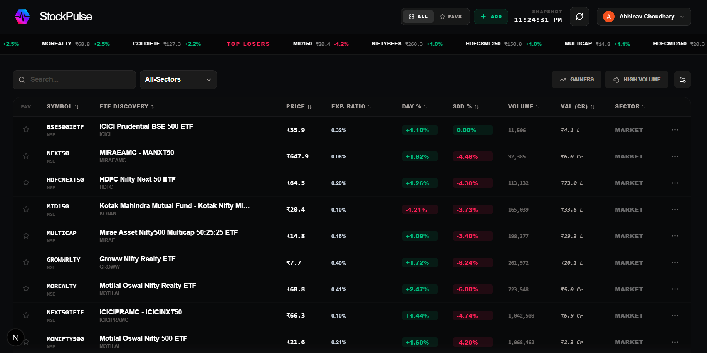

<div align="center">


# StockPulse

**Real-time ETF Dashboard for Indian Markets**

Track your personal ETF watchlist with live prices, expense ratios, AUM, performance metrics, and interactive charts — all in a premium dark-mode UI.

[](https://nextjs.org/)
[](https://www.typescriptlang.org/)
[](https://supabase.com/)
[](https://tailwindcss.com/)

<br/>



</div>

---

## ✨ Features

- 🔴 **Live Prices** — Real-time ETF quotes via Yahoo Finance
- 📊 **Expense Ratio & AUM** — Accurate metadata sourced from Groww.in
- 🔍 **Smart ETF Search** — Groww-powered search with precise Indian market results
- 📉 **Interactive Charts** — Candlestick & area charts with multiple time ranges
- ✏️ **Manual Metadata Override** — Edit expense ratio / AUM directly from the dashboard
- ⭐ **Personal Watchlist** — Add / remove ETFs, persisted per user via Supabase
- 🔃 **Sortable Columns** — Sort by price, AUM, expense ratio, 1D/30D change, volume
- 🎚️ **Column Customization** — Show/hide and reorder columns
- 🔐 **Authentication** — Email/password + Google OAuth via Supabase Auth
- 🌙 **Dark Mode** — Premium dark UI, mobile responsive

---

## 🛠️ Tech Stack

| Layer | Technology |
|---|---|
| Framework | Next.js 16 (App Router) |
| Language | TypeScript 5 |
| Styling | Tailwind CSS v4 + shadcn/ui |
| Database & Auth | Supabase (PostgreSQL) |
| Live Price Data | Yahoo Finance (`yahoo-finance2`) |
| ETF Metadata & Search | Groww.in (internal API + HTML scraping) |
| Charts | Lightweight Charts + Recharts |
| State Management | Zustand with localStorage persistence |
| Data Fetching | TanStack Query (React Query) |

---

## 🗂️ Project Structure

```
src/
├── app/
│   ├── api/
│   │   ├── stocks/        # Live price fetching (Yahoo Finance)
│   │   ├── enrich/        # ETF metadata enrichment (Groww)
│   │   ├── search/        # ETF search endpoint (Groww Search API)
│   │   └── metadata/      # Manual metadata updates (Supabase)
│   ├── login/             # Authentication page
│   └── settings/          # User account settings
│
├── components/
│   └── dashboard/
│       ├── stock-table.tsx        # Main ETF data table
│       ├── live-dashboard.tsx     # Dashboard shell + polling
│       ├── etf-search-modal.tsx   # Add ETF modal
│       ├── etf-summary-dialog.tsx # ETF detail drawer
│       ├── metadata-edit-dialog.tsx # Manual metadata editor
│       ├── history-chart.tsx      # Price history chart
│       └── sparkline.tsx          # Mini trend charts
│
├── lib/
│   ├── spreadsheet.ts     # Yahoo Finance data fetching & formatting
│   └── supabase/          # Supabase client helpers
│
├── store/                 # Zustand global state
└── providers/             # React Query + Theme providers
```

---

## 🚀 Getting Started

### 1. Prerequisites

- Node.js 20+
- A [Supabase](https://supabase.com) project

### 2. Supabase Setup

Create the following tables in your Supabase project:

```sql
-- User ETF watchlist
create table user_etfs (
  id uuid primary key default gen_random_uuid(),
  user_id uuid references auth.users(id) on delete cascade,
  ticker text not null,
  full_name text,
  sector text,
  company text,
  created_at timestamptz default now()
);

-- ETF metadata cache (expense ratio, AUM)
create table etf_metadata (
  ticker text primary key,
  expense_ratio numeric,
  aum_cr numeric,
  data_source text,
  last_fetched timestamptz
);
```

### 3. Environment Variables

Create a `.env.local` file in the project root:

```env
NEXT_PUBLIC_SUPABASE_URL=https://your-project.supabase.co
NEXT_PUBLIC_SUPABASE_ANON_KEY=your_anon_key
SUPABASE_SERVICE_ROLE_KEY=your_service_role_key
```

### 4. Install & Run

```bash
npm install
npm run dev
```

Open [http://localhost:3000](http://localhost:3000)

---

## 📡 Data Pipeline

```
User Dashboard Request
        │
        ▼
┌────────────────────┐     ┌───────────────────────┐
│  Yahoo Finance API │     │  Supabase etf_metadata│
│  (Live Quotes)     │  +  │  (Expense Ratio, AUM) │
└────────────────────┘     └───────────────────────┘
        │                            │
        └────────────┬───────────────┘
                     ▼
           Merged & Enriched Data
                     │
                     ▼
          Dashboard Table / Charts
```

Groww.in is used to:
1. **Search** — Find correct ETF slugs for Indian market symbols
2. **Enrich** — Scrape Expense Ratio and AUM from ETF detail pages
3. **Cache** — Results are stored in Supabase `etf_metadata` for 3 days

---

## 🌐 Deployment

Deploy on [Vercel](https://vercel.com) in one click:

[](https://vercel.com/new)

Set the same environment variables in your Vercel project settings under **Settings → Environment Variables**.

---

## 📄 License

MIT — feel free to use, fork, and build on top of this.