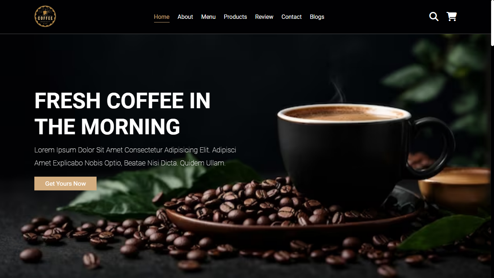

# Coffee Shop Website

Welcome to the **Coffee Shop Website** repository! This project features a fully responsive, creative, and eye-catching design with a dark theme. It's a one-page website showcasing various sections and built using **HTML**, **CSS**, and **JavaScript**.

---

## 🖼️ Screenshots



---

## 🌟 Live Demo
[Check out the live demo here](https://sheikh92areeb.github.io/coffee-shop/)

---

## 📜 Features

- **Responsive Design**: Optimized for all screen sizes and devices.
- **Dark Theme**: Modern and elegant look with a dark color palette.
- **Sections**:
  - Home
  - About
  - Menu
  - Products
  - Reviews
  - Contact
  - Blogs
- **Interactive Elements**:
  - CSS hover effects
  - JavaScript functionality for dynamic interactions

---

## 🛠️ Technologies Used

- **HTML**: Structure of the website.
- **CSS**: Styling and animations, including advanced hover effects.
- **JavaScript**: Added interactivity.

---

## 🚀 Getting Started

### Prerequisites
Make sure you have the following installed on your local machine:
- A modern browser
- A text editor (e.g., VS Code)

### Installation

1. Clone the repository:
   ```bash
   git clone https://github.com/sheikh92areeb/coffee-shop.git

2. Navigate to the project folder:
   ```bash
   cd coffee-shop
3. Open index.html in your browser to view the website.

---

## 💡 How to Contribute

### We welcome contributions! Here's how you can help:

1. Fork the repository.
2. Create a new branch:
   ```bash
   git checkout -b feature/your-feature-name
3. Commit your changes:
   ```bash
   git commit -m "Add your message here"
4. Push to your branch:
   ```bash
   git push origin feature/your-feature-name
5. Open a pull request.

---

## 📝 License

This project is open-source and available under the [MIT License](LICENSE).

---

## 📞 Contact

For questions or suggestions, feel free to contact us:
- **Email:** [mareebsheikh92@gmail.com](mailto:mareebsheikh92@gmail.com)  
- **GitHub:** (sheikh92areeb)

---

## ⭐ Acknowledgements

- Special thanks to all contributors.
- Icons and images used in this project belong to their respective owners.

---

## 🌟 Show Your Support

If you like this project, please give it a ⭐ on [GitHub](https://sheikh92areeb.github.io/coffee-shop/)


