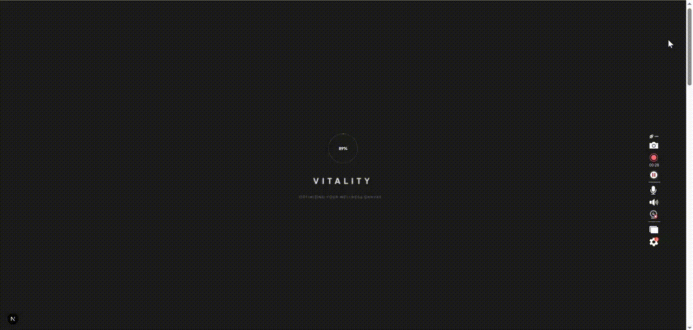
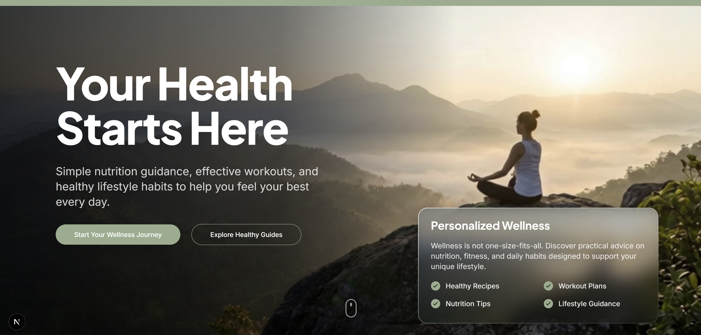
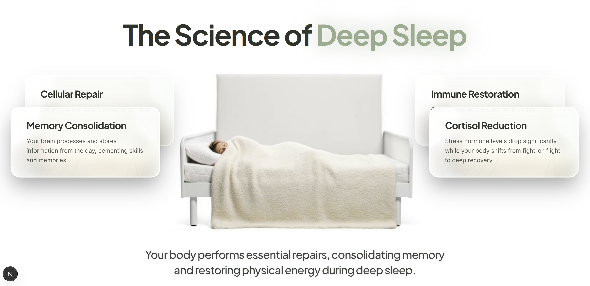
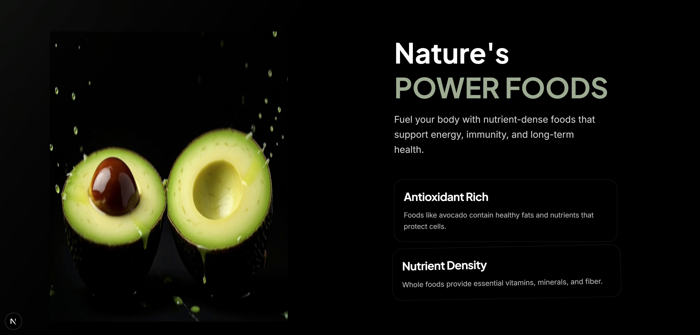
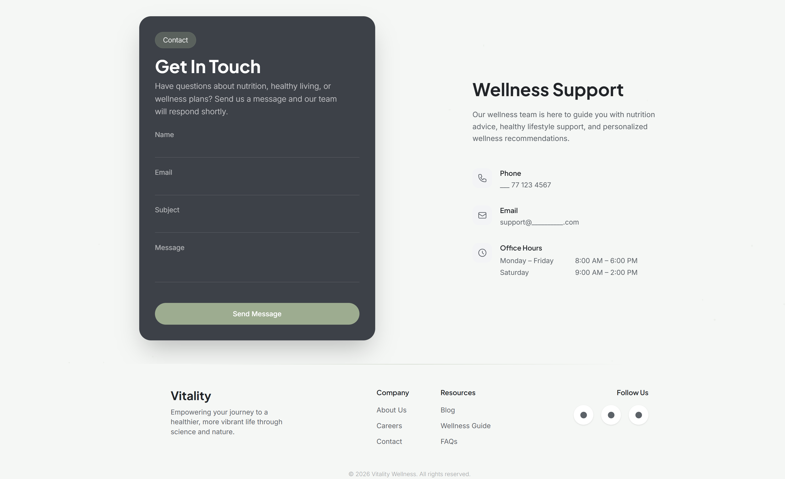

# 🌿 Wellness Lifestyle Interactive Website


[]()
[]()
[]()
[]()
[]()

A **cinematic scroll-driven wellness website** designed to communicate the importance of **sleep, nutrition, and healthy lifestyle habits** using **modern UI storytelling and subtle motion design**.

This project demonstrates how **interactive design can transform health education into an engaging visual experience**.

---

# 🎥 Live Interaction Demo


---

# 🎯 Problem Statement

Many health & wellness websites present valuable information using **static layouts and large blocks of text**, which often results in:

- Low user engagement
- Poor knowledge retention
- Limited emotional connection with wellness concepts

Modern web users expect **interactive experiences** that make information easier to understand and more enjoyable to explore.

The challenge was to design a **visually engaging platform that communicates health concepts clearly while maintaining a calm and premium experience**.

---

# 💡 Solution Approach

This project implements a **story-driven interactive landing page** using **scroll-based animations and cinematic transitions**.

Instead of presenting information statically, the website guides users through a **wellness journey**.

### Wellness Story Flow

**1️⃣ Sleep & Recovery**

A calming animated section illustrating how deep sleep supports recovery and overall health.

**2️⃣ Nature’s Power Foods**

A nutrition-focused section highlighting healthy foods using engaging visual elements and subtle animations.

**3️⃣ Wellness Support**

A premium contact section encouraging users to connect and explore wellness guidance.

Each section transitions smoothly to the next, creating a **cohesive storytelling experience similar to modern product showcase websites**.

---

# 🛠 Tech Stack Used

### Frontend

- **HTML5**
- **CSS3**
- **JavaScript**

### Motion & UI Effects

- Scroll-based animation logic
- CSS transforms & transitions
- Micro-interaction animations

### Design Tools

- Modern UI/UX design principles
- Visual storytelling layout strategy

### Deployment

- GitHub repository
- Static website hosting

---


# 📸 Screenshots


### Hero Section



### Sleep Science Section



### Nutrition Section



### Contact Section



---

# 📊 Key Results

| Metric | Result |
|------|------|
| Pages Designed | 4 |
| Interactive Sections | 3 |
| Scroll Animations | 10+ |
| UI Components | 20+ |
| Average Animation Render Time | < 1s |
| Responsive Design | Yes |

### Outcome

✔ Demonstrates **modern storytelling UI for health education**  
✔ Creates **higher visual engagement compared to static health websites**  
✔ Showcases **premium motion UX techniques**

---

# 📂 Project Structure
```
project/
│
├── index.html
├── style.css
├── script.js
│
├── assets/
│ ├── images/
│ ├── animations/
```


---

# 🚀 Future Improvements

- Integrate **GSAP ScrollTrigger** for advanced scroll animation control
- Add **interactive nutrition data visualizations**
- Implement **AI-powered wellness recommendations**
- Improve **mobile gesture interactions**
- Expand into a **full wellness education platform**


---

## License

MIT License — free to use, fork, and modify for personal or commercial projects.

---

<div align="center">

**Built by Dilshan Ganepola — MSc Health Informatics | MRCGP | US Patent Holder**  
General Physician & Healthcare AI Consultant
</div>
