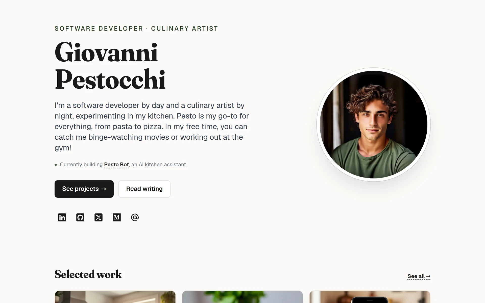

<div align="center">
  <picture>
    <source srcset=".github/assets/pesto-dark.webp" media="(prefers-color-scheme: dark)" />
    
  </picture>
  <p><em><strong>Pesto</strong> is a static, MDX-driven personal site template — portfolio, blog, recipes, the lot — built with <a href="https://nextjs.org/">Next.js</a>, <a href="https://tailwindcss.com/">Tailwind CSS</a>, and <a href="https://fonts.google.com/specimen/Fraunces">Fraunces</a>.</em></p>
</div>

<p align="center">
  <a href="https://github.com/sandeepraju/pesto/actions/workflows/node.js.yml"></a>
  <a href="https://github.com/sandeepraju/pesto/actions/workflows/nextjs.yml"></a>
  <a href="LICENSE"></a>
  
  
  
  
</p>

## Why Pesto

Most personal-site templates ship as visual scaffolding and leave the writing and case-study layer as an exercise for the reader. Pesto ships with the editorial wiring already in place:

- **MDX content layer** — six example blog posts and twelve project case studies, each as a single `.mdx` file with frontmatter. Add a post by dropping a file in `src/content/blog/`. Add a project by dropping a file in `src/content/projects/`. The list pages, detail pages, sitemap, related-posts, and prev/next nav all read the filesystem at build time.
- **Static export** — `next build` produces plain HTML. No runtime, no server, no API. Deploy to Vercel, Netlify, GitHub Pages, Cloudflare, or any static host.
- **Real design system** — CSS-variable tokens for colour, typography, spacing, radius, shadow, and motion. Light and dark themes wired to `prefers-color-scheme` plus a manual three-state toggle (System / Light / Dark) that persists across visits.
- **Brand identity** — display headings in [Fraunces](https://fonts.google.com/specimen/Fraunces) with variable optical-size + softness axes; UI in [Geist](https://vercel.com/font); a basil-green accent for tags, focus moments, and the avatar ring. Warm-paper background instead of pure white.
- **Performance** — build-time image blur placeholders via `sharp`, CSS columns instead of a masonry JS library, native View Transitions on project navigation, only one client-component island in the whole tree (the home avatar tilt).
- **Accessibility** — visible `:focus-visible` rings sitewide, skip-to-content link, one `<h1>` per page, `prefers-reduced-motion` respected by both CSS and the tilt, tap targets ≥ 44px, JSON-LD `Person` schema.

A full UX/design audit and roadmap that shipped this template is at [`docs/ux-audit.md`](docs/ux-audit.md).

## Getting started

```bash
git clone https://github.com/sandeepraju/pesto.git my-site
cd my-site
npm install
npm run dev
```

Open [http://localhost:3000](http://localhost:3000).

Other package managers work too:

```bash
yarn dev
pnpm dev
bun dev
```

## What's in the box

```
src/
├── app/
│   ├── about/                  # editorial bio page
│   ├── blog/                   # blog index + [slug] detail
│   ├── projects/               # project index + [slug] case study
│   ├── recipes/pesto/          # the actual pesto recipe
│   ├── now/                    # "what I'm focused on right now"
│   ├── uses/                   # hardware / software / kitchen kit
│   ├── colophon/               # design system, stack, process
│   ├── not-found.tsx           # on-brand 404 page
│   ├── sitemap.ts              # generated from filesystem at build
│   ├── robots.ts
│   ├── globals.css             # design tokens, theme overrides, focus ring
│   ├── layout.tsx              # fonts, metadata, JSON-LD, theme bootstrap
│   ├── page.tsx                # home (two-column hero + content strips)
│   └── components/
│       ├── PageShell.tsx       # shared Header + main + Footer scaffold
│       ├── Header.tsx
│       ├── Footer.tsx
│       ├── Nav.tsx
│       ├── TiltAvatar.tsx      # client island: react-parallax-tilt
│       └── ThemeToggle.tsx     # client island: System / Light / Dark
├── content/
│   ├── blog/*.mdx              # one post per file
│   └── projects/*.mdx          # one case study per file
├── lib/
│   ├── blog.ts                 # filesystem loader for posts
│   ├── projects.ts             # filesystem loader for projects
│   ├── blur.ts                 # image blur-placeholder lookup
│   └── styles.ts               # shared className constants
└── data/
    ├── config.json             # name, intro, social, site URL, meta
    └── blur-placeholders.json  # generated by scripts/generate-blur-placeholders.mjs
```

## Authoring content

### Writing a blog post

Drop a file in `src/content/blog/<slug>.mdx`:

````mdx
---
title: "My first post"
date: 2026-06-01
description: "A one-line description shown on the index page and in OG metadata."
tags: [process, cooking]
---

# Body starts here

Write in MDX. You can use **markdown**, embed any React-friendly element, drop
in `<code>` and code fences:

```ts
function pesto(basil: number) {
  return basil * 2;
}
```

> Or block-quote with a left bar.
````

That's it. The blog index sorts by date desc and shows reading time, tags, and description. The detail page renders the body through [`next-mdx-remote/rsc`](https://github.com/hashicorp/next-mdx-remote) with curated components (serif headings, dashed-underline links, surface-tinted code blocks, basil-bullet lists). Related posts at the bottom are tag-similarity ranked.

Tags are free-form strings — add `tags: [whatever, you, want]` and they'll show up as basil pills on the index and the post.

### Writing a project case study

Drop a file in `src/content/projects/<slug>.mdx`:

```mdx
---
title: "Pesto Bot"
description: "An AI kitchen assistant for pesto lovers."
image: /img/projects/pesto-bot.jpeg
portrait: true
year: 2026
role: "Solo build · 6 weeks"
tech: [Next.js, TypeScript, OpenAI API, Postgres, Tailwind]
url: https://github.com/gpestocchi/pesto-bot
order: 1
---

## The problem

Most cooking apps make you scroll past five recipe options...

## What I built

...

## What I learned

...
```

The projects index orders by `order` ascending and shows the image as a gradient-overlaid card with description-on-hover. The case study page shows the hero image, year/role/tech metadata, an optional GitHub CTA, the MDX body, and prev/next navigation.

`image` should be a path under `public/img/`; `portrait` controls card aspect in the masonry grid (true = h-96, false = h-64).

### Adding a recipe / now / uses / colophon page

These are plain React components — see `src/app/recipes/pesto/page.tsx`, `src/app/now/page.tsx`, etc. for the pattern. Wrap your content in `<PageShell>`, set the `metadata` export, you're done.

## Configuring

Edit `src/data/config.json`:

```json
{
  "name": "Your Name",
  "siteUrl": "https://yoursite.com",
  "intro": "One paragraph about you.",
  "fork": "https://github.com/your-user/your-site",
  "meta": {
    "title": "Your Name — Role 1 & Role 2",
    "description": "Personal site of Your Name."
  },
  "social": {
    "linkedin": "https://www.linkedin.com/in/you",
    "github": "https://github.com/you",
    "x": "https://x.com/you",
    "medium": "https://medium.com/@you",
    "email": "mailto:hello@yoursite.com"
  }
}
```

`siteUrl` is used for absolute URLs in `sitemap.xml`, `robots.txt`, and OG metadata — make sure it's set before you go live.

For your resume, replace `public/doc/Giovanni-Pestocchi-Resume.pdf` and update the Resume link in `src/app/components/Nav.tsx`.

For your photos, replace files in `public/img/` (keep `profile.jpg` and the `projects/` directory naming).

### Newsletter signup

The signup card (rendered on the home page and at the bottom of `/blog`) is a static HTML form that POSTs directly to a newsletter provider — no JS, no API key on your site, no server route. It works in the static export because the browser submits straight to the provider's embed endpoint.

The template ships pointing at [Buttondown](https://buttondown.com), a minimalist newsletter service (free up to 100 subscribers, paid above), but anything that accepts a form POST with a field named `email` works — ConvertKit, MailerLite, Beehiiv, Mailchimp, etc.

Configure under `newsletter` in `src/data/config.json`:

```json
"newsletter": {
  "enabled": true,
  "action": "https://buttondown.email/api/emails/embed-subscribe/YOUR_USERNAME",
  "provider": "Buttondown",
  "blurb": "Occasional posts on software, cooking, and what happens when you mix the two. One email per post, no spam, unsubscribe whenever."
}
```

- **`enabled`** — set to `false` (or remove the block) to hide the signup everywhere.
- **`action`** — the provider's embed URL. For Buttondown, sign up, then use `https://buttondown.email/api/emails/embed-subscribe/<your-username>`. For other providers, copy the `action` URL from their HTML embed snippet.
- **`provider`** — label shown in the "Delivered via …" footer. Cosmetic only.
- **`blurb`** — the paragraph above the input.

The form opens the provider's confirmation page in a new tab on submit (`target="_blank"`). If you want an inline "thanks, check your inbox" without a new tab, convert `src/app/components/NewsletterSignup.tsx` to a client component and submit via `fetch()`.

## Customising the look

### Theme

All colours are CSS variables in `src/app/globals.css`. Light and dark sets sit in `:root` and `:root[data-theme='dark']` blocks. The OS preference applies via a `@media (prefers-color-scheme: dark)` block scoped to `:root:not([data-theme='light'])` so a manual choice always wins.

Want a different accent? Change three values:

```css
:root {
  --accent: #3e5c3a;         /* deep basil */
  --accent-strong: #2c4329;  /* pine */
  --accent-soft: #d4ddd0;    /* young basil — used in tag pills */
}
```

Want a different mood entirely (e.g., paper-white instead of warm-paper)? Adjust `--background` and `--surface`.

### Fonts

Two Google Fonts are loaded in `src/app/layout.tsx`: Geist (body/UI) and Fraunces (display). Swap either:

```ts
import { Geist, Fraunces } from "next/font/google";
// → import { Inter, Source_Serif_4 } from "next/font/google";
```

If you change the serif, the optical-size + softness `font-variation-settings` tuned for Fraunces in `globals.css` may no longer apply — drop or adjust the `.font-serif { font-variation-settings: ... }` rule.

### Layout

The 3-row PageShell (header / main / footer) lives in `src/app/components/PageShell.tsx`. The home page uses a custom 2-row layout (`src/app/page.tsx`). Both use `grid-cols-[minmax(0,1fr)]` so long unbreakable content (e.g. a wide `<pre>` in a blog post) stays contained on mobile.

## Scripts

| | |
|---|---|
| `npm run dev` | Next.js dev server with Turbopack |
| `npm run build` | Static export to `out/` (runs `prebuild` first) |
| `npm run prebuild` | Generates `src/data/blur-placeholders.json` from `public/img/` via `sharp` |
| `npm run blur` | Same as `prebuild` — run manually after adding new images |
| `npm run start` | Serve the production build |
| `npm run lint` | ESLint over `src/` |

`prebuild` runs automatically before `build`, so blur placeholders are always fresh in production. If you add new images during development, run `npm run blur` to regenerate the manifest and pick up the placeholders without restarting the dev server.

## Deploying

This is a static export (`output: 'export'` in `next.config.ts`). `npm run build` writes to `out/` — drop that directory anywhere:

- **Vercel** — zero-config. Connect the repo and deploy.
- **Netlify** — set the build command to `npm run build` and publish directory to `out`.
- **GitHub Pages** — push `out/` to a `gh-pages` branch, or use the GitHub Actions deploy-to-pages action with `path: out`.
- **Cloudflare Pages** — build command `npm run build`, output directory `out`.
- **Any static host** — copy `out/` to your bucket of choice.

## Tech

- [Next.js 16](https://nextjs.org/) (App Router, static export)
- [React 19](https://react.dev/)
- [Tailwind CSS 3](https://tailwindcss.com/) with CSS-variable semantic tokens
- [`next-mdx-remote/rsc`](https://github.com/hashicorp/next-mdx-remote) for MDX
- [`gray-matter`](https://github.com/jonschlinkert/gray-matter) for frontmatter
- [`reading-time`](https://github.com/ngryman/reading-time) for post estimates
- [`sharp`](https://sharp.pixelplumbing.com/) for build-time blur placeholders
- [`react-parallax-tilt`](https://github.com/mkosir/react-parallax-tilt) for the home avatar
- [`react-icons`](https://react-icons.github.io/react-icons/) for nav + social glyphs

## License

[MIT](LICENSE).
