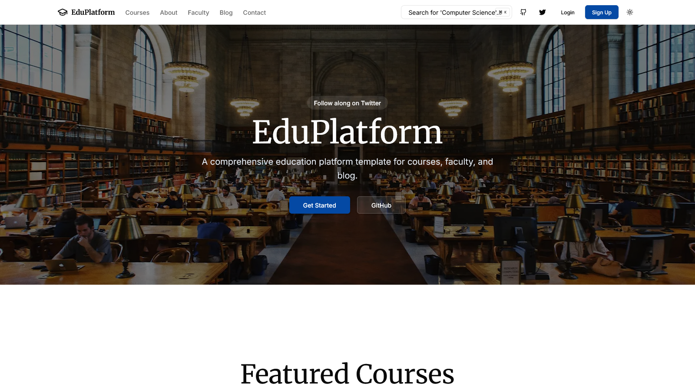

# EduPlatform - Education Website Template

<div align="center">


[](https://github.com/MasuRii/education-website-template/actions)
[](https://github.com/MasuRii/education-website-template/actions/workflows/deploy.yml)
[](package.json)
[](CONTRIBUTING.md)

**A modern, high-performance education platform template built with Next.js 14, TypeScript, Tailwind CSS, and Velite.**



[🚀 Live Demo](https://masurii.github.io/education-website-template/) | [Documentation](#-documentation) | [Quick Start](#-quick-start)

</div>

---

## Features

- **Modern Stack** - Next.js 14 App Router for the latest React features
- **Type Safe** - TypeScript and Zod for robust type safety throughout
- **Styling** - Tailwind CSS with Shadcn UI for beautiful, accessible components
- **Content Management** - Velite for type-safe MDX/Markdown content
- **Dark Mode** - Built-in theme switching (light/dark/system)
- **Global Search** - CMD+K command palette for courses, faculty, and blog
- **Secure Forms** - React Hook Form with Zod validation and security headers
- **Authentication** - Mock auth flow with persistent session simulation
- **Docker Ready** - Production-ready Dockerfile and Compose setup

## Tech Stack

| Category       | Technology                                      |
| -------------- | ----------------------------------------------- |
| **Framework**  | [Next.js](https://nextjs.org) v14.2.35          |
| **UI Library** | [React](https://react.dev) v18.3.1              |
| **Styling**    | [Tailwind CSS](https://tailwindcss.com) v3.4.19 |
| **Components** | [Shadcn UI](https://ui.shadcn.com)              |
| **Content**    | [Velite](https://velite.js.org) v0.3.1          |
| **Forms**      | [React Hook Form](https://react-hook-form.com)  |
| **Validation** | [Zod](https://zod.dev)                          |
| **Runtime**    | [Bun](https://bun.sh)                           |

## Quick Start

### Prerequisites

- [Bun](https://bun.sh) (recommended) or Node.js 18+
- [Git](https://git-scm.com)

### Installation

```bash
# Clone the repository
git clone https://github.com/MasuRii/education-website-template.git
cd education-website-template

# Install dependencies
bun install  # or npm install

# Start development server
bun dev  # or npm run dev
```

The site will be available at `http://localhost:3000`

## Commands

All commands are run from the root of the project:

| Command                | Description                                |
| ---------------------- | ------------------------------------------ |
| `bun install`          | Install dependencies                       |
| `bun dev`              | Start local dev server at `localhost:3000` |
| `bun run build`        | Build production site                      |
| `bun run start`        | Start production server                    |
| `bun run lint`         | Run ESLint for code quality                |
| `bun run format`       | Run Prettier for code formatting           |
| `bun run typecheck`    | Run TypeScript type checking               |
| `bun run test`         | Run unit tests                             |
| `bun run test:e2e`     | Run E2E tests with Playwright              |
| `bun run docker:build` | Build Docker image                         |
| `bun run docker:up`    | Start Docker environment                   |

## Project Structure

```
education-website-template/
├── content/              # Velite content (courses, blog, etc.)
├── infra/                # Infrastructure config (Docker, Lighthouserc)
├── public/               # Static assets
├── src/
│   ├── app/              # Next.js App Router pages
│   ├── components/
│   │   ├── ui/           # Shadcn UI components
│   │   └── ...           # Project components
│   ├── config/           # Site configuration
│   ├── hooks/            # Custom React hooks
│   ├── lib/              # Utility functions
│   ├── styles/           # Global CSS
│   └── types/            # TypeScript types
├── .github/workflows/    # GitHub Actions CI/CD
└── package.json
```

## Customization

### Content

Content is managed via **Velite**. MDX/Markdown files are located in the `content/` directory. The schema is defined in `velite.config.ts`.

### Styling

The project uses Tailwind CSS. You can customize the theme in `tailwind.config.ts` and global styles in `src/styles/globals.css`.

## Deployment

### GitHub Pages

1. Push your code to GitHub
2. Enable GitHub Pages in repository settings (Settings → Pages → Source: GitHub Actions)
3. The included workflow will automatically build and deploy on every push to `main`

### Vercel

1. Import the repository in [Vercel](https://vercel.com)
2. Deploy! (The `velite` build step is automatically handled)

### Docker

```bash
bun run docker:build
bun run docker:up
```

## Documentation

For detailed information on Velite content management, refer to the [Velite Documentation](https://velite.js.org).

## Contributing

Contributions are welcome! Please read our [Contributing Guidelines](./CONTRIBUTING.md) before submitting a pull request.

We follow:

- [Conventional Commits](https://www.conventionalcommits.org/)
- ESLint and Prettier for code style

---

<div align="center">

**Built with love by [MasuRii](https://github.com/MasuRii)**

If you found this helpful, please consider giving it a star!

[](https://github.com/MasuRii/education-website-template)

</div>
