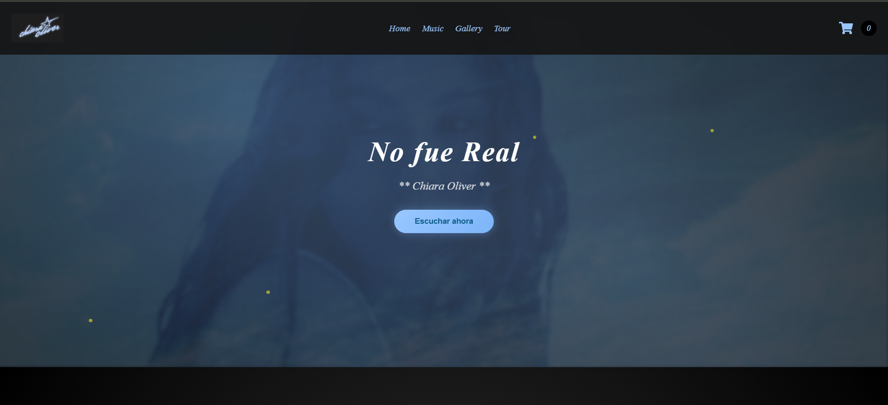
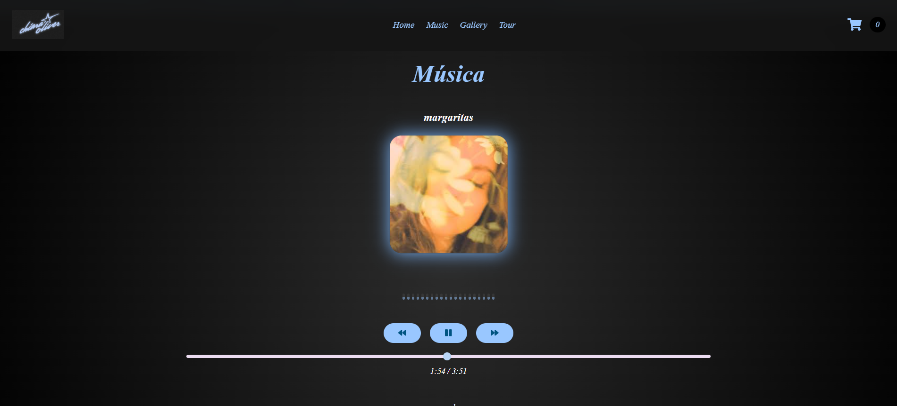
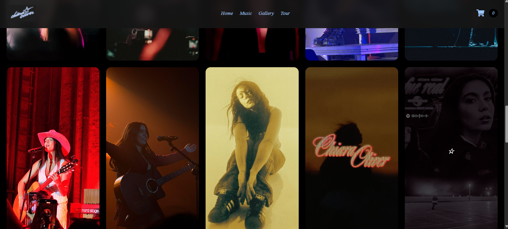
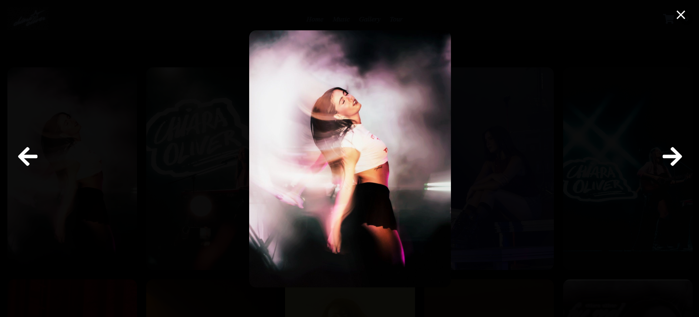
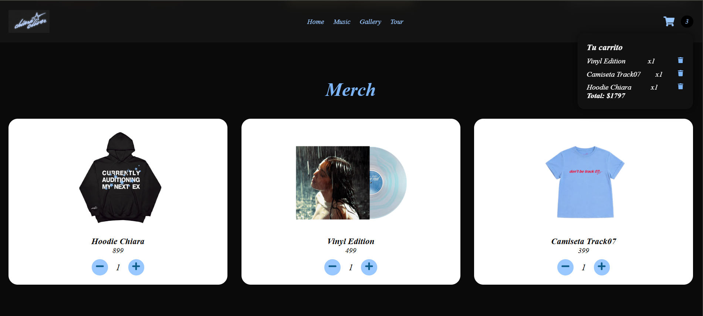

# 🎵 Artist Interactive Experience

Interactive artist landing page built with React + Vite.

A modern fan experience featuring music playback, animated UI, gallery modal, merch cart, and responsive design.

---

## 🚀 Live Demo

[View Live Site](https://artist-interactive-experience.vercel.app/)

---

## Features

- 🎧 Interactive music player
- 🛒 Animated shopping cart
- 🖼 Fullscreen gallery with swipe
- 🎤 Tour dates with maps
- 📱 Responsive design
- ✨ Modern animations and transitions

---

## 🛠 Tech Stack

- React
- Vite
- JavaScript
- CSS3
- React Icons

---

## 📸 Screenshots

### Hero Section


### Music Player


### Gallery Grid



### Fullscreen Modal



### Merch


### Tour
![Tour] (public/screenshots/tour.png)

---

## 📦 Installation

```bash
npm install
npm run dev
```

---

## 🧠 What I Practiced

- React state management
- Component structure
- Event handling
- Animations
- Responsive layouts
- UI/UX polish

---

## 👤 Author

Valeria Olvera